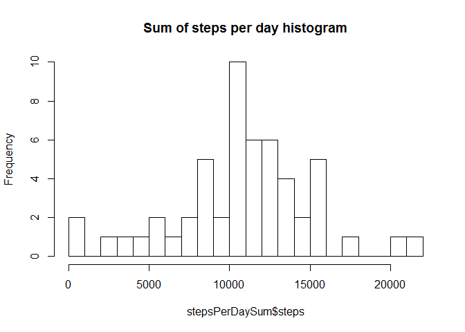
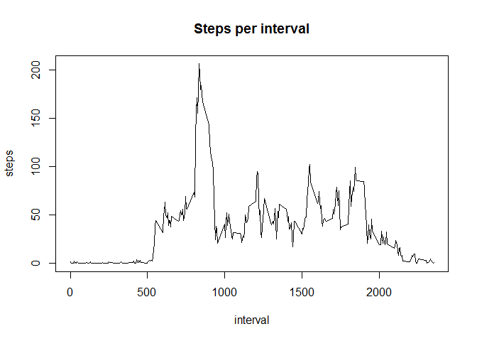
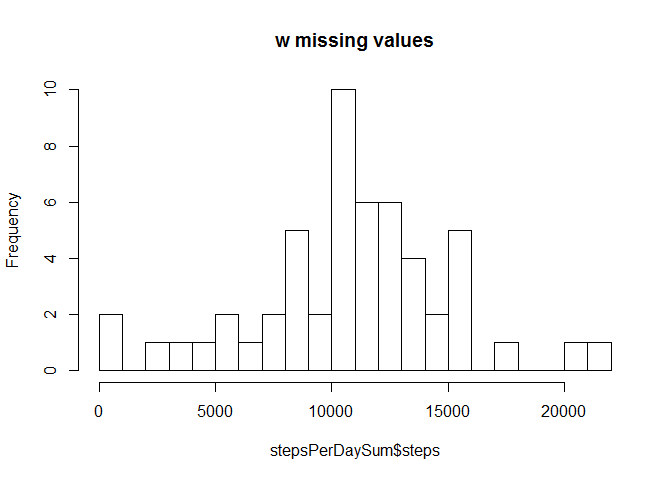
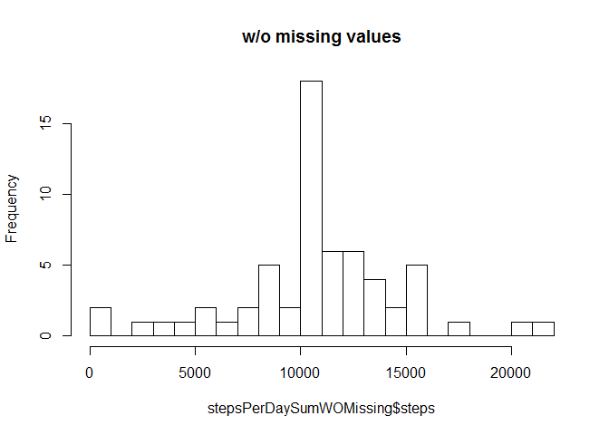
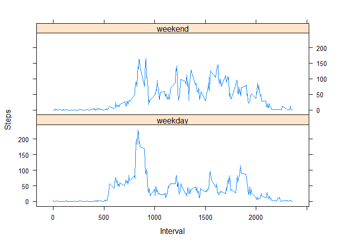

Loading data and preprocessing the data

    temp <- tempfile()
    download.file("https://d396qusza40orc.cloudfront.net/repdata%2Fdata%2Factivity.zip",temp)
    con <- unz(temp,"activity.csv")
    data <- read.csv(file = con, header=TRUE, quote="\"", sep=",")
    unlink(temp)
    stepsPerDayInterval <- as.data.frame(data)

What is mean total number of steps taken per day?
-------------------------------------------------

1.  Make a histogram of the total number of steps taken each day

<!-- -->

    stepsPerDaySum <- aggregate(steps ~ date, data = stepsPerDayInterval, FUN=sum, na.action = na.omit)
    hist(stepsPerDaySum$steps, breaks=20, main = "Sum of steps per day histogram")

1.  What is mean and median total number of steps taken per day?

<!-- -->

    mean(stepsPerDaySum$steps)

    ## [1] 10766.19

    median(stepsPerDaySum$steps)

    ## [1] 10765

What is the average daily activity pattern?
-------------------------------------------

1.  Make a time series plot (i.e. type = "l") of the 5-minute
    interval (x-axis) and the average number of steps taken, averaged
    across all days (y-axis)

<!-- -->

    stepsPerIntervalAvg <- aggregate(steps ~ interval, data = stepsPerDayInterval, FUN=mean, na.action = na.omit)
    plot(stepsPerIntervalAvg, type="l",main="Steps per interval")

2.Which 5-minute interval, on average across all the days in the
dataset, contains the maximum number of steps?

    apply(stepsPerIntervalAvg, 2, function(x) max(x, na.rm = TRUE))

    ##  interval     steps 
    ## 2355.0000  206.1698

Imputing missing values
-----------------------

1.Calculate and report the total number of missing values in the dataset
(i.e. the total number of rows with NAs)

    sum(is.na(stepsPerDayInterval$steps))

    ## [1] 2304

2.Devise a strategy for filling in all of the missing values in the
dataset. The strategy does not need to be sophisticated. For example,
you could use the mean/median for that day, or the mean for that
5-minute interval, etc.

I will mean for interval which is missing

3.Create a new dataset that is equal to the original dataset but with
the missing data filled in.

    stepsPerDayIntervalWOMissing <- merge(stepsPerDayInterval, stepsPerIntervalAvg, by.x="interval", by.y='interval', all.x=TRUE)
    stepsPerDayIntervalWOMissing <- transform(stepsPerDayIntervalWOMissing, steps = ifelse(is.na(steps.x), steps.y, steps.x))
    stepsPerDaySumWOMissing <- aggregate(steps ~ date, data = stepsPerDayIntervalWOMissing, FUN=sum, na.action = na.omit)

4.Make a histogram of the total number of steps taken each day and
Calculate and report the mean and median total number of steps taken per
day. Do these values differ from the estimates from the first part of
the assignment? What is the impact of imputing missing data on the
estimates of the total daily number of steps?

    hist(stepsPerDaySum$steps, breaks=20, main = "w missing values")

    hist(stepsPerDaySumWOMissing$steps, breaks=20, main = "w/o missing values")

    mean(stepsPerDaySumWOMissing$steps)

    ## [1] 10766.19

    median(stepsPerDaySumWOMissing$steps)

    ## [1] 10766.19

Are there differences in activity patterns between weekdays and weekends?
-------------------------------------------------------------------------

1.Create a new factor variable in the dataset with two levels --
"weekday" and "weekend" indicating whether a given date is a weekday or
weekend day.

    stepsPerDayIntervalWOMissing <- transform(stepsPerDayIntervalWOMissing, week = ifelse(weekdays(as.Date(date)) == "subota","weekend",ifelse(weekdays(as.Date(date)) == "nedjelja", "weekend", "weekday")))

2.Make a panel plot containing a time series plot (i.e. type = "l") of
the 5-minute interval (x-axis) and the average number of steps taken,
averaged across all weekday days or weekend days (y-axis).

    stepsPerIntervalWeekWOMissing <- with(stepsPerDayIntervalWOMissing,aggregate(steps ~ interval + week, FUN=mean))
    library(lattice)
    with(stepsPerIntervalWeekWOMissing, xyplot(steps~interval|factor(week), type='l',layout=c(1,2), xlab='Interval',ylab='Steps'))

